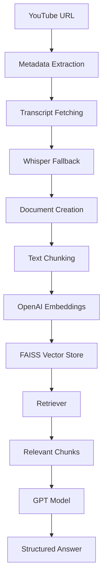

# 🎥 YouTube ChatBot using RAG

A Retrieval-Augmented Generation (RAG) application that allows users to chat with YouTube videos by extracting transcripts, retrieving relevant context, and generating grounded answers using Large Language Models (LLMs).

---

## 📌 Overview

This project enables users to interact with YouTube videos through natural language questions.

Instead of relying solely on the language model's internal knowledge, the system retrieves relevant transcript chunks from the selected video and uses them as context for answer generation. This ensures responses remain grounded in the video content and minimizes hallucinations.

The application supports:

* YouTube transcript extraction
* Whisper fallback for videos without captions
* Semantic search using embeddings
* FAISS vector database
* Context-aware answer generation
* Source chunk visualization
* Interactive Streamlit UI

---

## 🚀 Features

### 📺 Video Processing

* Extract YouTube video metadata
* Fetch official YouTube transcripts
* Whisper fallback support
* Automatic transcript chunking

### 🔍 Retrieval System

* OpenAI Embeddings
* FAISS Vector Store
* MMR (Maximum Marginal Relevance) Retrieval
* Semantic Similarity Search

### 🧠 RAG Pipeline

* Context-aware answer generation
* Structured output parsing
* Confidence scoring
* Source-grounded responses
* Hallucination reduction

### 💻 User Interface

* Streamlit Dashboard
* Video metadata display
* Session analytics
* Retrieved source visualization
* Chat-based interaction

---

## 🏗️ Architecture



---

## 📂 Project Structure

```text
YouTube ChatBot using RAG
│
├── app.py
├── requirements.txt
├── README.md
├── .env.example
│
├── data/
│
├── src/
│   ├── chains/
│   │   └── rag_chain.py
│   │
│   ├── ingestion/
│   │   ├── youtube_fetcher.py
│   │   └── whisper_fallback.py
│   │
│   ├── retrieval/
│   │   └── retriever.py
│   │
│   ├── services/
│   │   └── video_processor.py
│   │
│   ├── splitting/
│   │   └── document_builder.py
│   │
│   ├── ui/
│   │   ├── header.py
│   │   ├── sidebar.py
│   │   ├── video_section.py
│   │   ├── chat_section.py
│   │   ├── source_section.py
│   │   ├── metrics_section.py
│   │   ├── footer.py
│   │   ├── custom_css.py
│   │   └── session.py
│   │
│   ├── vectorstore/
│   │   ├── embeddings.py
│   │   └── faiss_store.py
│   │
│   └── config.py
│
└── tests/
    ├── test_embeddings.py
    ├── test_pipeline.py
    └── test_retriever.py
```

---

## ⚙️ Installation

### Clone Repository

```bash
git clone <YOUR_GITHUB_REPO_URL>
cd YouTube-ChatBot-RAG
```

### Create Virtual Environment

```bash
python -m venv venv
```

### Activate Virtual Environment

Windows:

```bash
venv\Scripts\activate
```

Linux / macOS:

```bash
source venv/bin/activate
```

### Install Dependencies

```bash
pip install -r requirements.txt
```

---

## 🔑 Environment Variables

Create a `.env` file in the project root.

```env
OPENAI_API_KEY=your_openai_api_key
```

---

## ▶️ Run Application

Start the Streamlit application:

```bash
streamlit run app.py
```

The application will be available at:

```text
http://localhost:8501
```

---

## 📸 Screenshots

### Home Page


### Chat Interface


### Retrieved Sources


---

## 🔄 Workflow

1. User enters a YouTube URL.
2. Video metadata is extracted.
3. Transcript is fetched from YouTube.
4. If captions are unavailable, Whisper fallback is used.
5. Transcript is split into chunks.
6. Chunks are converted into embeddings.
7. Embeddings are stored in FAISS.
8. User asks a question.
9. Relevant chunks are retrieved.
10. GPT generates a context-grounded response.
11. Retrieved sources are displayed alongside the answer.

---

## 🛠️ Tech Stack

### Frameworks & Libraries

* Python
* Streamlit
* LangChain

### LLM & Embeddings

* OpenAI GPT
* OpenAI Embeddings

### Retrieval

* FAISS
* MMR Retrieval

### Data Sources

* YouTube Transcript API
* yt-dlp
* Whisper

### Utilities

* Pydantic
* dotenv

---

## 📚 What I Learned

Through this project I gained practical experience with:

* Retrieval-Augmented Generation (RAG)
* Embedding Models
* Vector Databases
* Semantic Search
* Prompt Engineering
* Structured Output Parsing
* Context Grounding
* Streamlit Application Development
* Project Modularization
* End-to-End AI Application Development

---

## 🔮 Future Improvements

* Multi-video conversations
* Hybrid search
* Support for additional LLM providers
* Cloud vector databases
* Persistent chat history
* Browser extension integration
* Chrome plugin for direct YouTube interaction

---

## 🤝 Contributing

Contributions, suggestions, and improvements are welcome.

Feel free to fork the repository and submit a pull request.

---

## 📄 License

This project is licensed under the MIT License.

---

## ⭐ Acknowledgements

Special thanks to:

* OpenAI
* LangChain
* Streamlit
* FAISS
* YouTube Transcript API

for providing the tools and frameworks that made this project possible.
